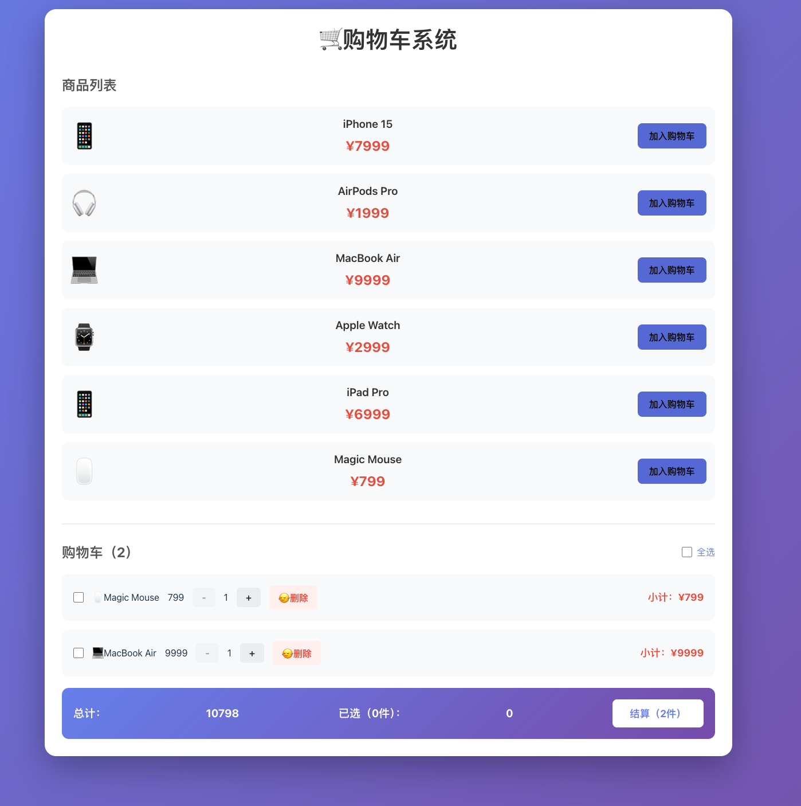

# 🛒 购物车系统 (Shopping Cart)

## 📝 项目简介
一个基于 React 开发的响应式购物车管理系统。项目实现了从商品浏览、加入购物车到订单结算的完整闭环流程，并深度集成了浏览器本地存储以确保购物数据持久化。

## ✨ 功能特性
- ✅ **商品展示与选购**：展示商品列表，支持一键加入购物车，重复添加时自动累加数量。
- ✅ **精细化数量控制**：支持商品数量增减，并具备边界校验（数量为 1 时禁用减少按钮）。
- ✅ **智能选择机制**：支持单选、全选/取消全选，以及针对选中项的批量删除功能。
- ✅ **实时计算系统**：动态计算每项商品的小计金额，以及全站的总计金额和已选商品总价。
- ✅ **数据持久化**：深度集成 `localStorage`，确保用户刷新页面后购物车内容不丢失。

## 🛠️ 技术栈
- **框架**: React 18 (Hooks: `useState`, `useEffect`)
- **数据流**: 数组高级方法 (`map`, `filter`, `reduce`, `find`)
- **存储**: LocalStorage API
- **样式**: CSS3

## 🌐 关于数据处理逻辑
本项目在数据管理上遵循了 React 的最佳实践：
1. **持久化存储**：通过 `useEffect` 监听 `cart` 状态的变化，实时将数据同步至本地存储。
2. **派生状态计算**：如“已选商品 (`checkedItem`)”和“总价”并非独立状态，而是基于 `cart` 状态实时计算得出，确保了数据源的唯一性。

## 📸 项目截图



## 🚀 本地运行
```bash
# 安装依赖
npm install

# 启动开发服务器
npm start

# 启动后访问：
http://localhost:3000

```

## 💡 项目亮点
- **健壮的数据初始化**：在 `useState` 中通过 `try...catch` 块对 `localStorage` 的解析进行了异常捕获，有效防止了本地存有脏数据时导致应用崩溃。
- **数组不可变更新**：严格使用 `map` 和 `filter` 等非破坏性方法更新状态，确保 React 能够精准捕捉数据变化并高效渲染 UI。
- **交互体验优化**：
  - **状态驱动 UI**：根据勾选状态动态显示“删除所选”按钮。
  - **视觉反馈**：通过按钮的 `disabled` 状态和 Emoji 符号提升操作直观性。