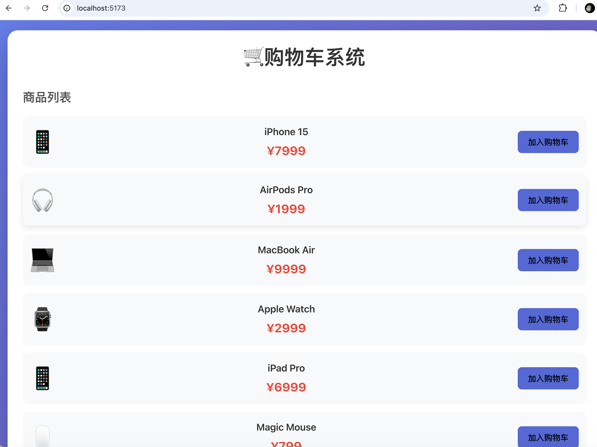
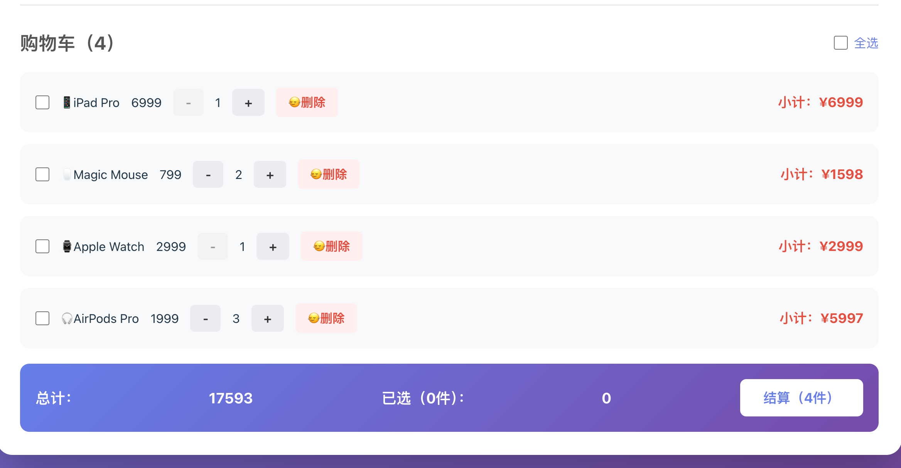
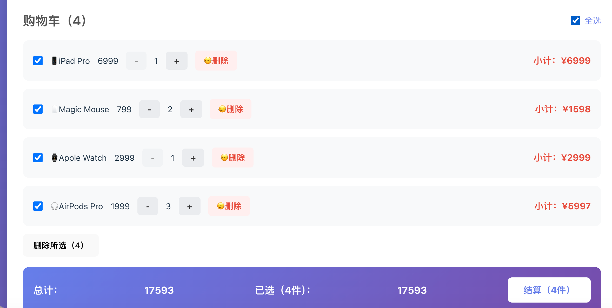
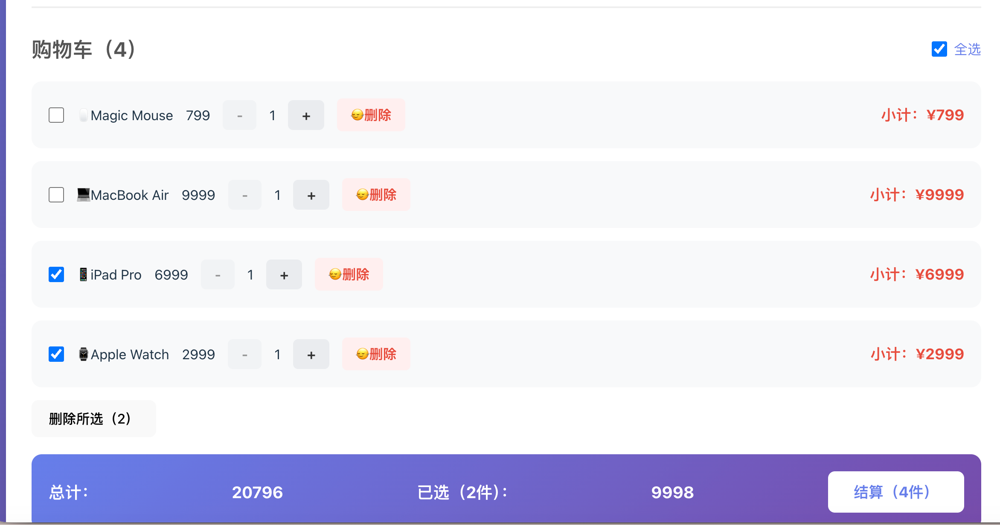

# 🛒 购物车系统

一个使用React开发的购物车应用


## ✨ 功能特性

- ✅ 商品展示
- ✅ 添加到购物车（重复添加自动增加数量）
- ✅ 数量增减（减到1时按钮禁用）
- ✅ 商品勾选
- ✅ 全选/取消全选
- ✅ 批量删除选中商品
- ✅ 实时计算总价
- ✅ 数据持久化（localStorage）

## 🛠️ 技术栈

- React 18
- CSS3
- localStorage

## 📚 学到的知识点

- React Hooks (useState, useEffect)
- 数组方法 (map, filter, reduce, find, every)
- 条件渲染
- 事件处理
- 本地存储

## 🚀 运行项目
```bash
npm install
npm start
```

## 📝 开发心得

这是我的第二个React项目，在开发过程中：
- 理解了数组的不可变更新
- 掌握了购物车的状态管理逻辑
- 学会了CSS伪类选择器的使用
- 体会到了视觉效果对开发动力的影响

## 📸 截图





---

💡 **学习记录**：2025年1月 | 持续学习React中