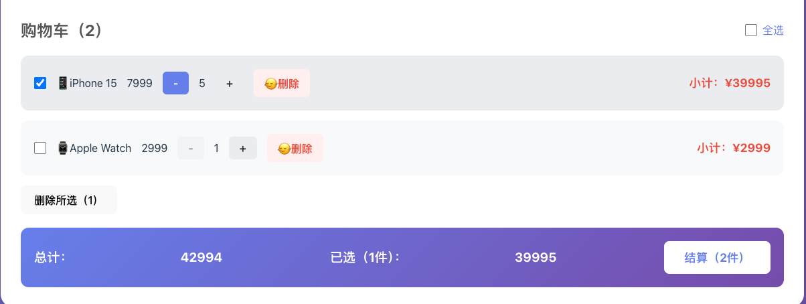

# 🛒 React Shopping Cart

## 📝 项目简介

一个基于 React 开发的购物车系统。支持商品展示、加入购物车、数量调整、价格计算等完整的购物流程，使用 localStorage 实现购物车数据持久化。


## 📸 项目截图

### 1. 核心界面预览
展示商品列表与购物车的整体布局。


---

### 2. 动态交互演示
实时展示数量加减逻辑，当商品减至 1 件时，"—" 按钮将自动禁用以防止误操作。



---

### 3. 智能结算与批量处理
仅在选中商品后才显示"删除所选"按钮，并实时计算已选件数与总价。


## ✨ 主要功能

- 🛍️ **商品展示**：展示商品列表，包含名称、价格、图片
- ➕ **加入购物车**：一键添加商品到购物车
- 🔢 **数量管理**：增加/减少商品数量，智能禁用防误操作
- ☑️ **商品选择**：支持单选/全选商品
- 🗑️ **批量删除**：删除选中的商品
- 💰 **智能结算**：实时计算选中商品的件数和总价
- 💾 **数据持久化**：使用 localStorage 保存购物车状态


## 🛠️ 技术栈

- **框架**：React (Hooks: useState, useEffect)
- **数据存储**：localStorage
- **样式**：CSS3 (Flexbox 布局)


## 🌟 项目亮点

- ✅ **组件化开发**：商品列表、购物车分离，代码结构清晰
- ✅ **状态管理**：使用 React Hooks 统一管理购物车状态
- ✅ **数据持久化**：刷新页面购物车数据不丢失
- ✅ **智能交互**：数量为1时自动禁用减少按钮
- ✅ **批量操作**：支持全选和批量删除
- ✅ **实时计算**：自动计算选中商品的总价和件数


## 📂 项目结构
```
shopping-cart/
├── src/
│   ├── App.js          # 主应用组件
│   ├── App.css         # 样式文件
│   └── index.js        # 入口文件
├── public/
└── package.json
```


## 🚀 快速开始

### 安装依赖
```bash
npm install
```

### 启动项目
```bash
npm start
```

访问 http://localhost:3000


## 💡 核心功能实现

### 购物车状态管理
```javascript
const [cart, setCart] = useState([]);
const [products, setProducts] = useState([...]);
```

### 添加到购物车
```javascript
const addToCart = (product) => {
  const existingItem = cart.find(item => item.id === product.id);
  if (existingItem) {
    setCart(cart.map(item => 
      item.id === product.id 
        ? { ...item, quantity: item.quantity + 1 }
        : item
    ));
  } else {
    setCart([...cart, { ...product, quantity: 1 }]);
  }
};
```

### 数据持久化
```javascript
useEffect(() => {
  localStorage.setItem('cart', JSON.stringify(cart));
}, [cart]);
```


## 🎨 界面特点

- 📱 **响应式设计**：适配不同屏幕尺寸
- 🎯 **清晰布局**：商品列表和购物车分栏显示
- 💅 **现代样式**：圆角、阴影、过渡动画
- 🔴 **价格高亮**：红色显示价格，醒目直观
- ✨ **智能禁用**：防止用户误操作


## 👤 作者

**Lilyann**  
GitHub: [@Lilyann007](https://github.com/Lilyann007)


## 📄 License

MIT License